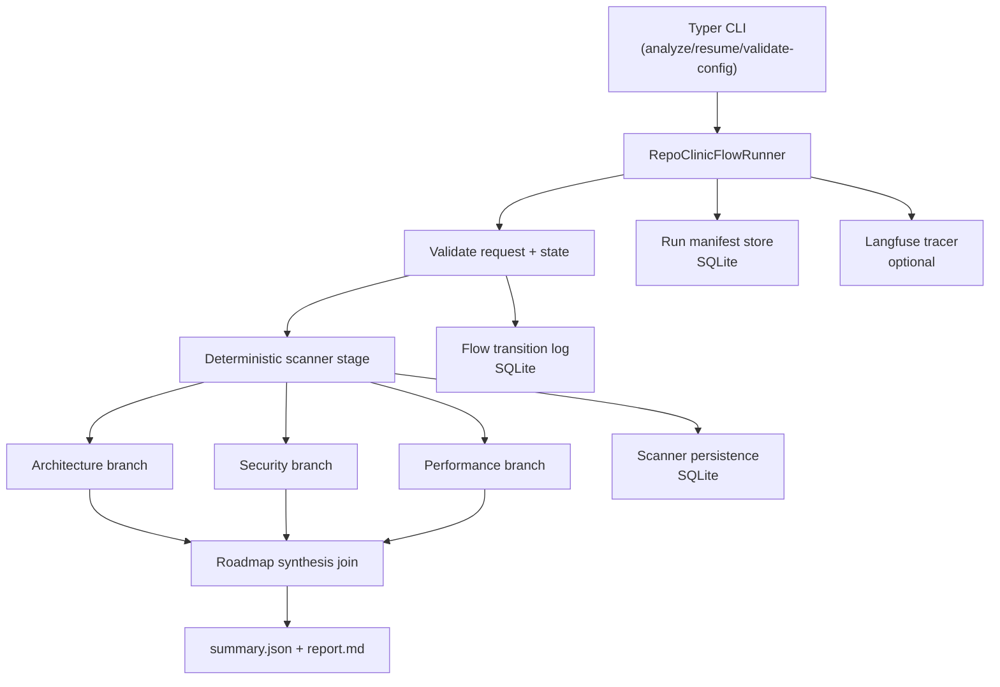
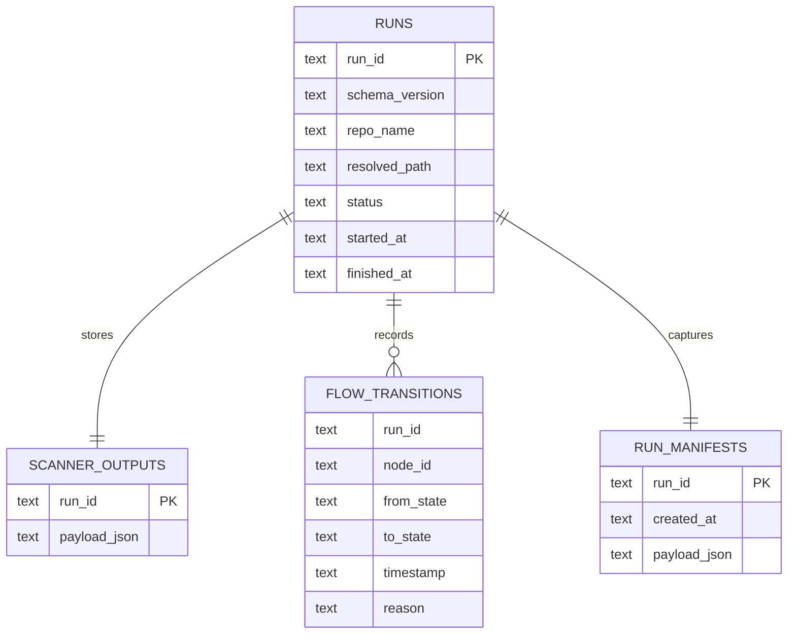

# Architecture

## 1) System overview

RepoClinic implements a scanner-first stateful flow as a deterministic pipeline:

## 2) Component boundaries

| Component | Responsibility |
|---|---|
| `repoclinic.cli` | Operator-facing commands and input validation |
| `repoclinic.flow` | Flow orchestration, checkpointing, resume logic |
| `repoclinic.scanner` | Deterministic source resolution, scoped inventory, heuristics, evidence normalization, dependency lockfile discovery |
| `repoclinic.agents` | Branch analyzers and roadmap synthesis |
| `repoclinic.artifacts` | Deterministic `summary.json` and `report.md` generation |
| `repoclinic.config` | Typed config loading and provider profile resolution |
| `repoclinic.observability` | Run manifest persistence and optional Langfuse tracing |

## 3) Flow execution model

1. Validate request payload and provider profile.
2. Execute scanner stage first (deterministic, bounded by scan policy and timeouts, with fixture paths excluded by default).
3. Fan out architecture/security/performance branches.
4. Fan in to roadmap synthesis after branch completion (including degraded outcomes).
5. Materialize report artifacts and persist metadata.

## 4) Data schema (SQLite)

RepoClinic persists scanner snapshots, transition logs, and run manifests in SQLite.

## 5) External interfaces

- **Input surfaces**
  - local path (`--path`)
  - GitHub URL (`--repo`)
- **Output surfaces**
  - `summary.json`
  - `report.md`
- **Observability surface**
  - Langfuse SDK over `LANGFUSE_BASE_URL` (Langfuse Cloud endpoint)
- **Toolchain dependencies**
  - `git`, `rg`, `semgrep`, `bandit`, `osv-scanner`
  - `go` (required when `osv-scanner` is installed from source via `go install`)

## 6) Runtime control points

- Provider switching is config-driven (`config/settings.yaml` + env overrides).
- Retry/timeout behavior is centrally configured and applied by flow stages.
- Scanner scope is policy-driven; `tests/fixtures/**` is excluded by default to prevent fixture-only technology bleed-through in repo profiling.
- OSV dependency scanning runs lockfile-targeted mode first and falls back to recursive scanning only when lockfile mode is unavailable.
- LM-driven branch outputs are normalized before strict schema validation to handle provider/model output variance.
- Branch execution can run through CrewAI-backed models or deterministic heuristic mode.
